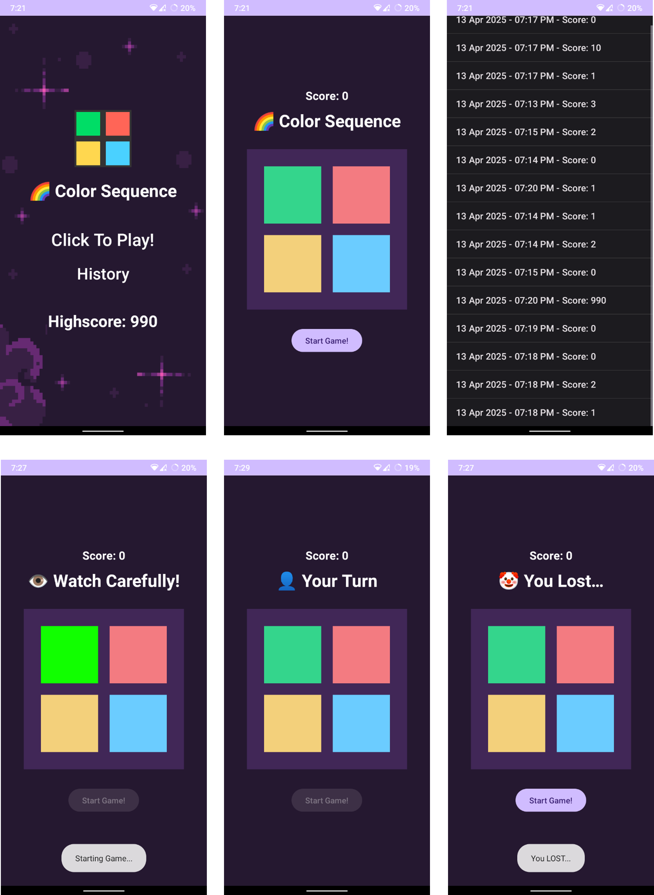

# 🎮 ColorSequence Game

## 🕹️ About the Game

**ColorSequence Game** is a simple memory-based game where players must repeat a sequence of colors shown to them. The sequence grows longer with each correct move. The player loses when they fail to repeat the sequence correctly. 

The game tracks the top score and displays the player’s history of previous scores, with an option to view past results.

---

## 🔧 Features

- 🎮 **Color Memory Game**: Repeat the color sequence that is shown to you.
- 🏆 **Top Score**: Track your highest score and compete for the best result.
- 📜 **Game History**: View previous game scores with timestamps.
- 🔒 **Shared Preferences**: Save the top score and history using Android’s SharedPreferences.
- 🕹️ **Interactive UI**: Highlight colors and handle button clicks to control gameplay.
- ⚡ **Smooth Transitions**: Game sequence and user input is handled with smooth transitions and animations.

---

## 📱 Screenshots

---

## 🛠️ Tech Stack

- **Frontend**: Android (Java)
- **Data Storage**: SharedPreferences for storing the top score and game history.
- **UI Framework**: Android Views (Buttons, TextViews, ListViews)

---

## 🎮 How to Play

1. **Start Game**: Tap the "Start Game" button to begin the game.
2. **Watch the Sequence**: A random sequence of colors will be shown. The game will highlight each color in turn.
3. **Repeat the Sequence**: Tap the colored buttons in the same order that you saw.
4. **Lose Condition**: If you tap the wrong color or sequence, the game ends, and your score will be recorded.
5. **View History**: Check your past scores and the top score under the "History" screen.